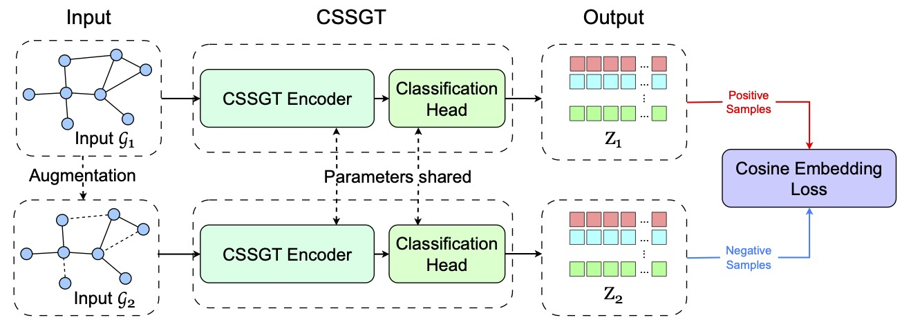
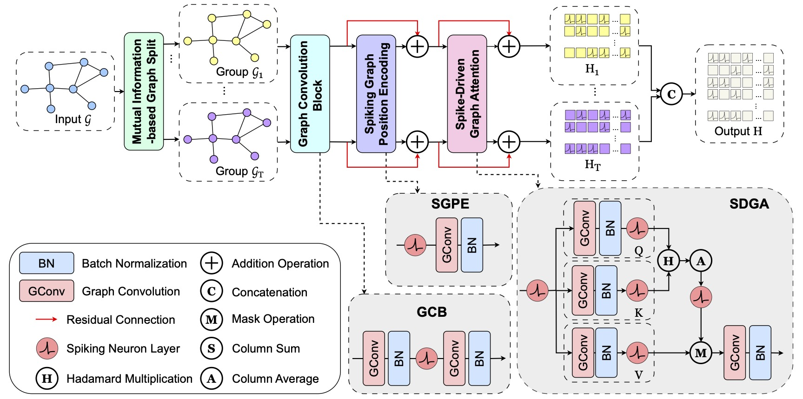
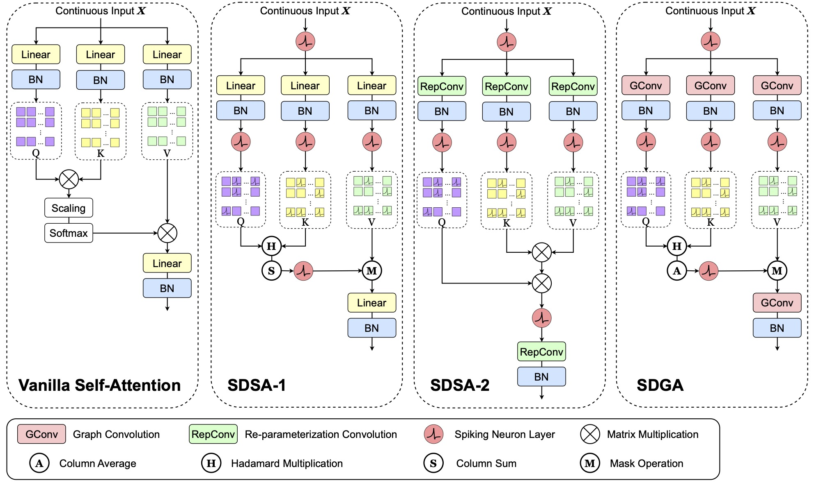

# 0. Introduction

This is the source code of the paper _Enhancing Graph Transformers with SNNs and Mutual Information_ accepted at ECML-PKDD 2025.

# 1. Run the code

Simply run the 6 files to reproduce the results! The brief description of files are given below:

1. **run.py**: quickly see the performance of CSSGT without saving.
2. **main.py**: quickly reproduce the accuracy curve of CSSGT and save.

# 2. Main Requirements

python == 3.8

torch == 2.0.0

torch_geometric ==2.3.0

CUDA 11.8

# 3. CSSGT Architecture

1. Overall architecture.
   

2. Detailed architecture.
   

3. Architecture comparison between Spike-Driven Graph Attention and other attention mechanisms.
   
